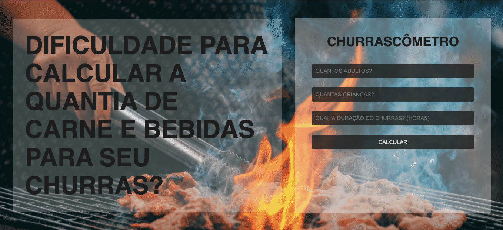

<h1 align="center">🥩 CHURRASCÔMETRO 🥩</h1>

    <h2>Demonstração: </h2>
    
    

<h1 align="center">💻 Projeto:</h1>

O projeto Churrascômetro foi feito com o intuito de ajudar o povo que gosta de um churrasco, mas não sabe a quantidade exata de carne, cerveja e bebidas para comprar. A aplicação também leva em consideração a presença de crianças e adapta as quantidades necessárias de carne e bebidas de acordo com o número de crianças.

A duração do churrasco também é um fator importante para determinar a quantidade de comes e bebes a serem compradas. Se o evento tiver uma duração maior do que 6 horas, esse quantidade vai ser adaptada de acordo com essa duração.

Foram utilizados os seguintes critérios:

<ul>
    <li>Carne - 400g por pessoa. + de 6hrs 650g</li>
    <li>Cerveja - 1200ml por pessoa. + de 6hrs 2000ml</li>
    <li>Refrigerante/Água - 1000ml por pessoa + de 6hrs 1500ml</li>
    <li>Crianças valem por 1/2</li>
</ul>

<h1>Tecnologias utilizadas: </h1>
<ul>
    <li>HTML</li>
    <li>CSS</li>
    <li>JavaScript</li>
</ul>
